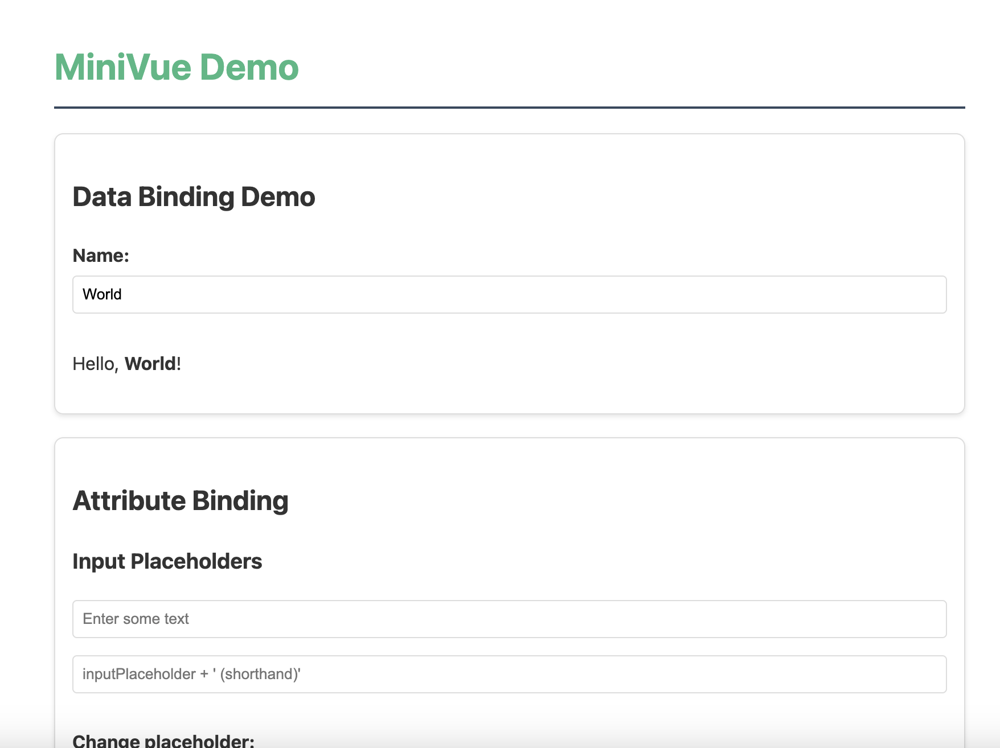

# MiVue - v0.02
<!-- 

 -->


MiVue is simple, slim JS UI framework inspired from Vue.js and Alpine.js
A lightweight, reactive MiVue provides the core reactivity features of Vue with a simple and intuitive API of Alpine making is easier for beginners and non-ui devs to get the job done.

NOTE: Python pyvue is also in the making

## Features

- **Reactive Data Binding** - Automatically updates the DOM when data changes
- **Template Syntax** - Familiar mustache syntax `{{ value }}` for text interpolation
- **Two-way Binding** - Form elements stay in sync with your data model
- **Conditional Rendering** - Show/hide elements based on data conditions
- **Event Handling** - Easily attach event listeners with method binding and parameters
- **Attribute Binding** - Dynamically set HTML attributes based on data
- **Form Support** - Works with various form elements (inputs, checkboxes, select dropdowns, etc.)
- **Developer Tools** - Debug mode with detailed logging
- **Error Handling** - Comprehensive error catching and reporting
- **Directives** - Powerful template syntax for manipulating the DOM
- **Component-Based** - Organize your UI into modular components
- **Computed Properties** - Derived state that updates automatically
- **List Rendering** - Efficiently render lists with the m-for directive

## Getting Started


### Installation

Simply include the script in your HTML:

```html
<script src="mivue.js"></script>
```

### Basic Usage

```html
<div id="app">
  <p>{{ message }}</p>
  <input m-model="message">
</div>

<script>
  const app = new MiVue({
    el: '#app',
    data: {
      message: 'Hello MiVue!'
    }
  });
</script>
```

## Directives

### Text Interpolation

Use double curly braces to display reactive data in your templates:

```html
<p>Hello, {{ name }}!</p>
```

### m-model

Creates two-way data binding on form elements:

```html
<!-- Text input -->
<input type="text" m-model="message">

<!-- Checkbox -->
<input type="checkbox" m-model="isChecked">

<!-- Radio buttons -->
<input type="radio" m-model="selectedOption" value="option1">
<input type="radio" m-model="selectedOption" value="option2">

<!-- Select dropdown -->
<select m-model="selected">
  <option value="option1">Option 1</option>
  <option value="option2">Option 2</option>
</select>

<!-- Textarea -->
<textarea m-model="description"></textarea>
```

### m-if

Conditionally render an element based on a boolean value:

```html
<div m-if="showContent">
  This content will only show when showContent is true.
</div>
```

### m-bind

Dynamically bind HTML attributes based on expressions:

```html
<!-- Regular syntax -->
<input m-bind:placeholder="inputPlaceholder">
<button m-bind:disabled="isDisabled">Submit</button>

<!-- Shorthand syntax using ":" -->

<a :href="linkUrl">Visit Website</a>

<!-- Expressions are supported -->
<div :style="'color: ' + textColor">Colored Text</div>
<progress :value="progress" :max="100"></progress>
```

### Event Handling

Bind event listeners with multiple syntax options:

```html
<!-- Regular syntax -->
<button m-on:click="handleClick">Click Me</button>

<!-- Shorthand syntax -->
<button @click="handleClick">Click Me</button>

<!-- With parameters -->
<button @click="increment(5)">Add 5</button>

<!-- Using $event to access the original DOM event -->
<input @input="updateValue($event)">

<!-- Multiple event types -->
<div @mouseenter="handleMouseEnter" @mouseleave="handleMouseLeave">
  Hover over me
</div>
```

### m-for

Render lists of items:

```html
<ul>
  <li m-for="item in items">{{ item.name }}</li>
</ul>
```

You can also include an index:

```html
<div m-for="(item, index) in items">
  {{ index }}: {{ item.name }}
</div>
```

Inside m-for loops, you can access:
- The current item directly
- Item properties using dot notation: `item.property`
- Methods and data from the main instance

Example with events and conditional styling:

```html
<div m-for="todo in todos" :class="{'completed': todo.completed}">
  <input type="checkbox" m-model="todo.completed">
  <span>{{ todo.text }}</span>
  <button @click="removeTodo(todo)">Delete</button>
</div>
```

## Options API

```javascript
const app = new MiVue({
  // Element to mount to
  el: '#app',
  
  // Debug mode
  debug: true,
  
  // Data properties (reactive)
  data: {
    message: 'Hello MiVue!',
    count: 0,
    isVisible: true,
    buttonColor: 'blue',
    linkUrl: 'https://example.com'
  },
  
  // Methods
  methods: {
    increment(amount = 1) {
      this.count += amount;
    },
    toggleVisibility() {
      this.isVisible = !this.isVisible;
    },
    handleEvent(event) {
      console.log('Event triggered:', event.type);
    }
  }
});
```

## Complete Example

```html
<!DOCTYPE html>
<html lang="en">
<head>
  <meta charset="UTF-8">
  <title>MiVue Example</title>
  <style>
    .btn {
      padding: 8px 16px;
      border-radius: 4px;
      cursor: pointer;
      margin-right: 8px;
    }
  </style>
</head>
<body>
  <div id="app">
    <h1>{{ title }}</h1>
    
    <input type="text" m-model="title" :placeholder="titlePlaceholder">
    
    <p>Count: {{ count }}</p>
    <button @click="increment" class="btn" :style="'background-color: ' + buttonColor">Increment</button>
    <button @click="increment(5)" class="btn" :disabled="isMaxedOut">Add 5</button>
    <button @click="decrement" class="btn">Decrement</button>
    
    <div>
      <label>
        <input type="checkbox" m-model="showExtra"> Show extra content
      </label>
      
      <div m-if="showExtra">
        <p>This is additional content that can be toggled.</p>
        <input type="text" m-model="linkUrl">
        <p><a :href="linkUrl" target="_blank">Visit link</a></p>
      </div>
    </div>
    
    <div class="mouse-tracker" 
         @mousemove="trackMouse($event)"
         :style="'border: 1px solid #ccc; height: 100px; display: flex; align-items: center; justify-content: center;'">
      <span>Mouse position: X: {{ mouseX }}, Y: {{ mouseY }}</span>
    </div>
  </div>

  <script src="mivue.js"></script>
  <script>
    const app = new MiVue({
      el: '#app',
      debug: true,
      data: {
        title: 'MiVue Demo',
        titlePlaceholder: 'Enter a title',
        count: 0,
        buttonColor: '#42b883',
        showExtra: true,
        linkUrl: 'https://github.com',
        mouseX: 0,
        mouseY: 0,
        isMaxedOut: false
      },
      methods: {
        increment(amount = 1) {
          this.count += amount;
          this.isMaxedOut = this.count >= 10;
        },
        decrement() {
          if (this.count > 0) {
            this.count--;
            this.isMaxedOut = false;
          }
        },
        trackMouse(event) {
          this.mouseX = event.offsetX;
          this.mouseY = event.offsetY;
        }
      }
    });
  </script>
</body>
</html>
```

## How It Works

MiVue uses JavaScript's `Object.defineProperty` to make data properties reactive. When a property is accessed during rendering, it's registered as a dependency. When the property changes, all registered dependencies are notified to update.

The update process uses a publisher-subscriber pattern with Dep (dependency) and Watcher classes inspired by Vue's implementation.

### Event Handling System

MiVue's event handling supports:
- Direct method binding (`@click="handleClick"`)
- Method calls with parameters (`@click="increment(5)"`)
- Access to the DOM event via `$event` parameter
- Support for all standard DOM events (click, input, change, mouseenter, etc.)

### Attribute Binding System

The attribute binding system allows:
- Binding any HTML attribute to data properties
- Supporting expressions with concatenation and simple operations
- Boolean attributes (like disabled, required) that respond to truthy/falsy values
- Style and class binding for dynamic styling

## Limitations

Being a minimal implementation, MiVue lacks some Vue.js features:

- No virtual DOM
- No component system
- No computed properties (currently)
- No lifecycle hooks
- No transitions
- No directive modifiers
- Limited expression evaluation capability

## License

MIT

## Testing

MiVue includes a comprehensive test suite to ensure all framework features work correctly.

### Test Setup

The test suite uses:
- **Mocha**: Test runner
- **JSDOM**: For simulating a browser environment in Node.js
- **Built-in assertions**: For verifying behavior

### Running Tests

To run tests, make sure you have Node.js installed, then:

1. Install dependencies first:
   ```bash
   npm install
   ```

2. Run the test suite:
   ```bash
   npm test
   ```

3. For continuous testing during development:
   ```bash
   npm run test:watch
   ```

### What Gets Tested

The test suite verifies all core functionality:
- Data binding and reactivity
- Two-way binding with m-model directive
- Conditional rendering with m-if directive
- Event handling with parameters and $event
- Attribute binding with dynamic attributes

### Troubleshooting Framework Issues

If you encounter issues:

1. Enable debug mode: `debug: true` in your MiVue instance
2. Check the console for detailed logs of what's happening
3. Verify that your templates are correctly structured
4. Review the event handlers and attribute bindings for syntax errors


